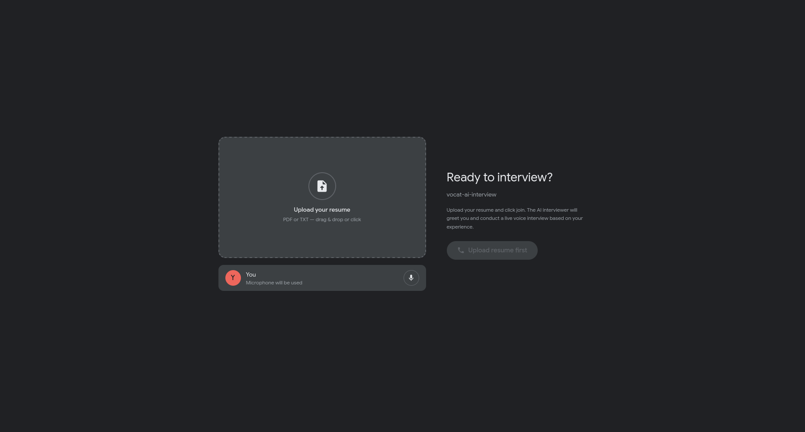
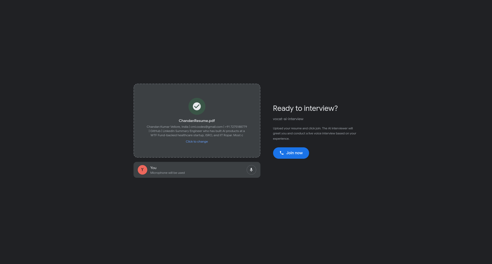
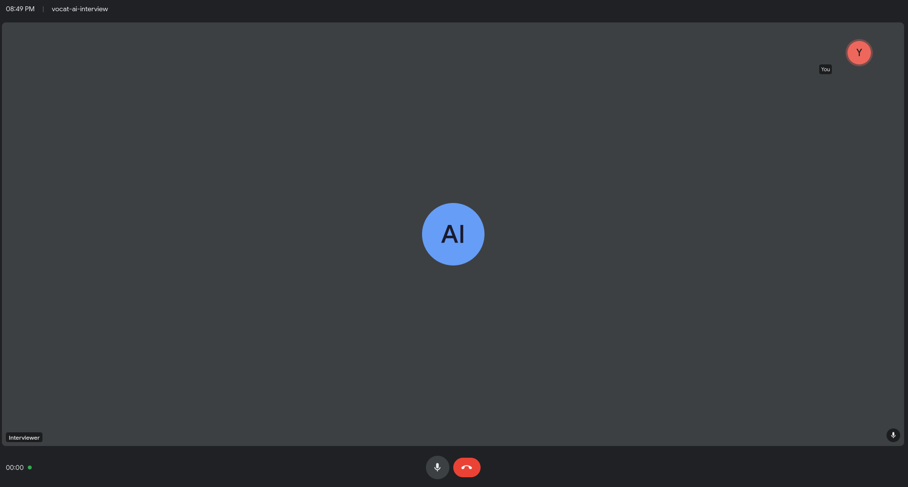

# Vocat — AI Interview Agent

A real-time AI interview agent with a Google Meet-style interface. Upload your resume, join the call, and the AI conducts a live voice interview — no typing, no lag, just a natural conversation.



## How It Works

1. **Upload your resume** — drag & drop or click to upload (PDF/TXT)
2. **Join the call** — the AI interviewer greets you and starts asking questions based on your resume
3. **Talk naturally** — voice activity detection handles turn-taking automatically
4. **Get interviewed** — behavioral questions, technical deep-dives, follow-ups — just like a real interview





## Architecture

```
Mic → WebRTC → VAD → Whisper STT → GPT-4o → ElevenLabs TTS → WebRTC → Speaker
```

- **WebRTC** for full-duplex, low-latency audio streaming
- **Voice Activity Detection** for automatic turn-taking (no push-to-talk)
- **Whisper** for speech-to-text
- **GPT-4o** with streaming for fast, context-aware responses
- **ElevenLabs Turbo** for natural text-to-speech
- **Sentence-level TTS** — starts speaking before the full response is generated

## Tech Stack

| Layer | Tech |
|-------|------|
| Frontend | React + Vite + Tailwind CSS |
| Transport | WebRTC (aiortc) |
| VAD | webrtcvad |
| STT | OpenAI Whisper |
| LLM | GPT-4o (streaming) |
| TTS | ElevenLabs (turbo v2.5) |
| Backend | Python + aiohttp |

## Setup

### Prerequisites

- Python 3.10+
- Node.js 18+
- FFmpeg
- OpenAI API key
- ElevenLabs API key

### Install

```bash
# Clone
git clone https://github.com/modelpath-dev/Vocat.git
cd Vocat

# Python dependencies
pip install -r requirements.txt

# Frontend dependencies
cd frontend && npm install && cd ..

# Environment variables
cp .env.example .env
# Edit .env with your API keys
```

### Run

```bash
# Terminal 1 — Backend
export $(cat .env | xargs) && python vocatl2_backend.py

# Terminal 2 — Frontend
cd frontend && npm run dev
```

Open `http://localhost:5173` in your browser.

## Configuration

### VAD

```python
VAD_AGGRESSIVENESS = 3        # 0-3, higher = less sensitive to background noise
VAD_SILENCE_TIMEOUT_MS = 600  # ms of silence before processing speech
```

### Voice

Change the voice in `vocatl2_backend.py`:

```python
voice_id="EXAVITQu4vr4xnSDxMaL"  # Sarah — see ElevenLabs voice library
```

### Interview Prompt

Edit `prompts/interviewer.md` to customize the interviewer's behavior, question style, or focus areas.

## Project Structure

```
vocat/
├── vocatl2_backend.py       # WebRTC server + AI pipeline
├── frontend/
│   ├── src/
│   │   ├── App.jsx          # Google Meet-style UI
│   │   ├── hooks/
│   │   │   └── useWebRTC.js # WebRTC client hook
│   │   └── index.css
│   ├── vite.config.js
│   └── package.json
├── prompts/
│   └── interviewer.md       # Interview system prompt
├── .env.example
├── requirements.txt
└── README.md
```

## License

MIT
